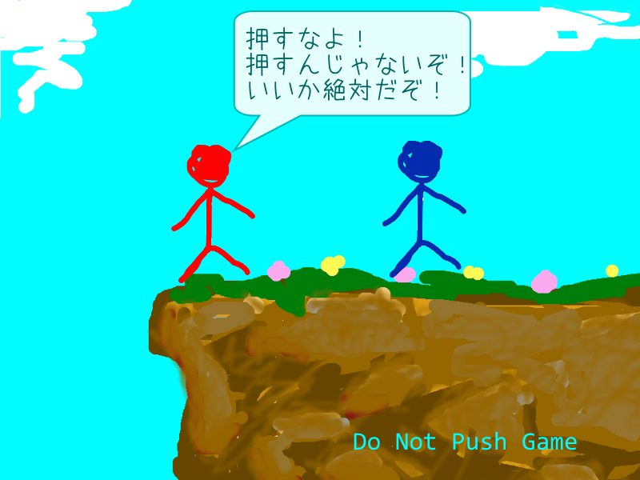

# Do Not Push Game ～押すなよ！絶対！～

日本は言霊の強い、不思議な国。
ならば言霊で遊ぼうやないか！
押すなよ！絶対！

製作中。

## dependency 依存関係
- [DxLibEx](https://github.com/Nagarei/DxLibEx)
- [DxLib](http://homepage2.nifty.com/natupaji/DxLib/)

最終的にGHandleとSHandleはDxLibExに移行する。暫定的にオレオレclassを使用中・・・

## Compiler Support 対応コンパイラー
- Visual Studio 2013 (deprecated)
- Visual Studio 2013 November CTP
- Visual Studio 2015
