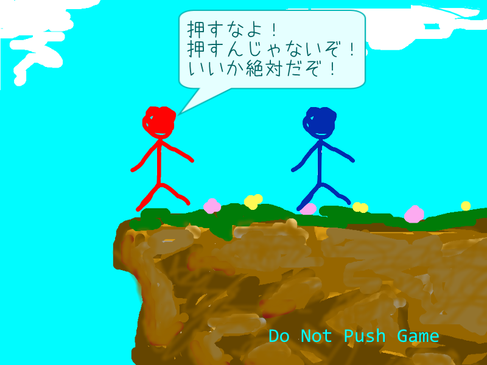

# Do Not Push Game ～押すなよ！絶対！～

日本は言霊の力が強い、不思議な国。  
ならば言霊で遊ぼうやないか！  
押すなよ！絶対！



製作中。

## Download方法
[Release](https://github.com/TakeObara/DoNotPushGame/releases)よりビルド済みバイナリが手にはいります。

https://gist.github.com/yumetodo/1bc47ce42b6128e1950c
を使用するとReleaseから最新版を落としてきます。DVDに焼く場合はこれを推奨します。

ソースコードは

```sh
git clone https://github.com/TakeObara/DoNotPushGame.git
```

もしくは

```sh
https://yumetodo@bitbucket.org/yumetodo/donotpushgame.github
```

## dependency 依存関係
- [DxLibEx](https://github.com/Nagarei/DxLibEx)
- [DxLib](http://homepage2.nifty.com/natupaji/DxLib/)

最終的にGHandleとSHandleはDxLibExに移行する。暫定的にオレオレclassを使用中・・・

## Compiler Support 対応コンパイラー
- Visual Studio 2013 November CTP
- Visual Studio 2015

## Compile方法
1. 環境変数``DXLIB_ROOT``と``DXLIBEX_ROOT``を設定する  
ex.)``DXLIB_ROOT``を``D:\lib\DxLib_VC\プロジェクトに追加すべきファイル_VC用``に  
``DXLIBEX_ROOT``を``C:\Users\yumetodo\Documents\git\DxLibEx``に
2. ``Don't_push.sln``を開く
3. ビルド構成を適切に選択する。Visual Studio 2015の人は``VS2015Debug``または``VS2015Release``に。なおVisual Studio2013の人はビルドツールセットの設定をやり直すこと。(November CTPいれよう)
4. ビルド→ソリューションのビルドでビルドする

## 動作環境
- OS : Microsoft Windows Vista/7/8/10(＊XPはビルドツールセット変えれば行けると思いますがサポートしません)
- CPU: SSE2対応CPU(＊ビルドツールセット変えればSSE2なしで行けますが今時SSE2使えないPCなんてないよね？)
- メモリ: 128MB以上
- DirectX9以降が必要

## ゲーム操作方法
- 十字キー:移動
- Zキー:状態変遷
- Esc:終了

## ゲーム終了方法
ウィンドウ右上の閉じるボタンを押すかEscボタンを押す

## 使用素材
- あずきフォント  
http://azukifont.com/kiyaku.html

## 免責事項
このプログラムを実行したことによって生じたいかなる損害について作者は一切の責任を負いません。


